<!-- ─────────────────────────  HERO  ───────────────────────── -->

  

<!-- ─────────────────────────  ABOUT  ───────────────────────── -->

I build systems where LLMs are components, not the whole product — agent loops with real tool access, retrieval pipelines that cite their sources, and backends that keep working after the demo ends. Most recently that's meant a multi-agent orchestration framework with its own evaluation loop, an incident-response platform where agents self-correct before a human has to step in, and an enterprise RAG platform built from the data layer up.

I care less about "does it work in the notebook" and more about "does it survive a database migration, a bad LLM response, and a Monday morning." That's the gap between a project and a system, and it's the one I keep building toward.

<!-- ─────────────────────────  CURRENTLY BUILDING  ───────────────────────── -->

  

<!-- ─────────────────────────  TECH STACK  ───────────────────────── -->

  

<!-- ─────────────────────────  GITHUB STATS  ───────────────────────── -->

  
  

  

<!-- ─────────────────────────  CONNECT  ───────────────────────── -->

  
  
  

Open to AI/ML engineering internships and new-grad roles.

<!-- ─────────────────────────  FOOTER  ───────────────────────── -->

  

---

  

